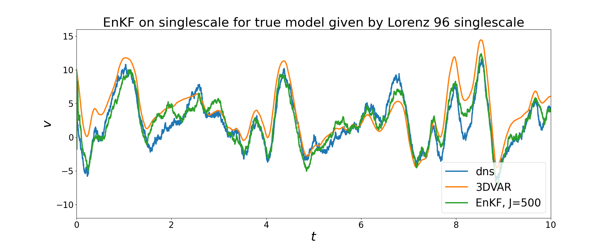

## Ensemble Kalman Methods



Ensemble Kalman methods and numerical experiments from the paper "Ensemble Kalman Methods: A Mean Field Perspective" (https://arxiv.org/abs/2209.11371). To cite this repository use

```
@article{Calvello2025Ensemble,
  title={Ensemble {K}alman Methods: A Mean Field Perspective},
  author={Calvello, Edoardo and Reich, Sebastian and Stuart, Andrew M},
  journal={Acta Numerica},
  year={2025}
}
```

The code contained in the files [./Lorenz96/DATools_.py](./Lorenz96/DATools_.py) and [./Lorenz96/L96_multiscale.py](./Lorenz96/L96_multiscale.py) is due to Dmitry Burov. If using the Lorenz `96 data generation files, please also cite 

```
@article{Burov2021Kernel,
  title={Kernel analog forecasting: {M}ultiscale test problems},
  author={Burov, Dmitry and Giannakis, Dimitrios and Manohar, Krithika and Stuart, Andrew},
  journal={Multiscale Modeling \& Simulation},
  volume={19},
  number={2},
  pages={1011--1040},
  year={2021},
  publisher={SIAM}
} 
```

## Quick Start Guide

The folder [Data_Assimilation](./Data_Assimilation/) contains the DA algorithms used in the paper. Namely, the file [DA_Filtering.py](./Data_Assimilation/DA_Filtering.py) contains the filtering schemes `ThreeDVAR` and `EnKF`, on the other hand the file [DA_Inversion.py](./Data_Assimilation/DA_Inversion.py) contains `EKI_transport`, which can be used for both Bayesian inversion and optimization, and `EKI_post` for Bayesian inversion. 

To generate the Lorenz `96 data from the paper, run the python script [data_gen.py](./Lorenz96/data_gen.py) from the [Lorenz96](./Lorenz96/) folder.

To run the filtering experiments from the paper, run the python scripts [3DVAR_L96m.py](./Filtering_Experiments/3DVAR_L96m.py), [3DVAR_L96s.py](./Filtering_Experiments/3DVAR_L96s.py) and [EnKF_L96s.py](./Filtering_Experiments/EnKF_L96s.py), either running them directly or through the script [run.sh](./Filtering_Experiments/run.sh). This will create a "results" folder containing the saved data. To subsequently generate the plots of the paper run the python script [generate_plots.py](./Filtering_Experiments/generate_plots.py).

Similarly, to run the inversion experiments from the paper, run the python scripts [EKI_1D.py](./Inversion_Experiments/EKI_1D.py), [EKI_L96.py](./Inversion_Experiments/EKI_L96.py), either running them directly or through the script [run.sh](./Inversion_Experiments/run.sh). This will again create a "results" folder containing the saved data. To subsequently generate the plots of the paper run the python script [generate_plots.py](./Inversion_Experiments/generate_plots.py).